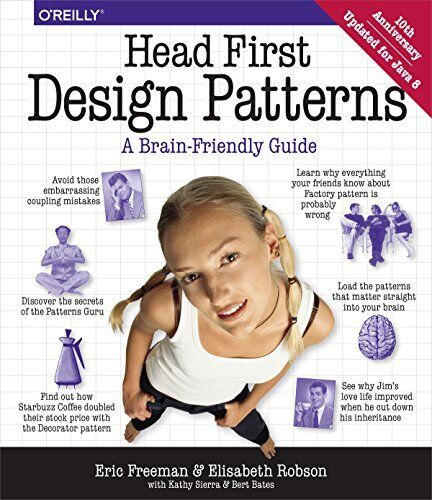

= Practice #5

*Main takeaway:* read the book below and use common sense

.plan
* [ ] Creational
* * [ ] Builder, Optional, Promise
* * [ ] Fluent interface
* * [ ] Optional, Promise
* [ ] Structural
* * [ ] Proxy, Decorator https://stackoverflow.com/q/18618779/4337151[the difference]
* [ ] Behavioral
* * [ ] Observer
* * [ ] Strategy
* * [ ] Iterator